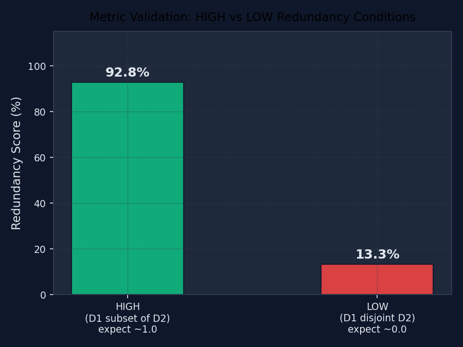
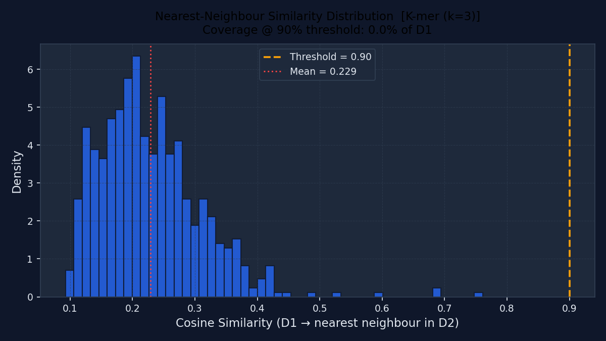
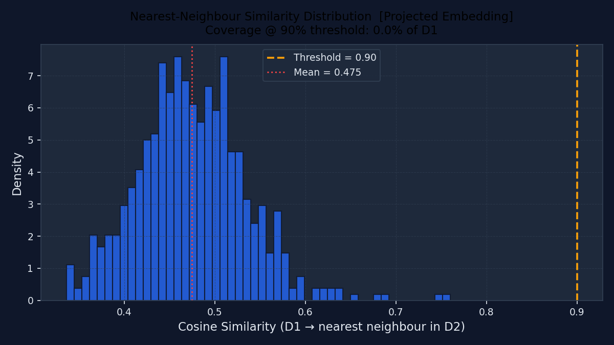
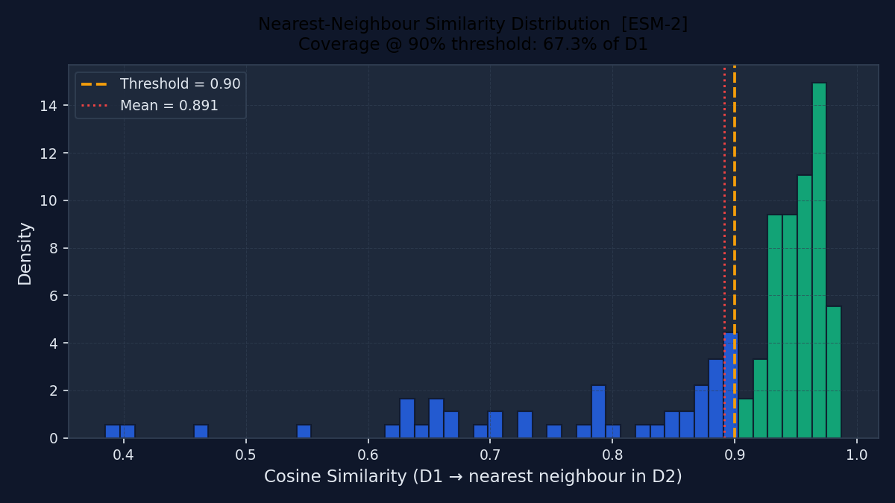
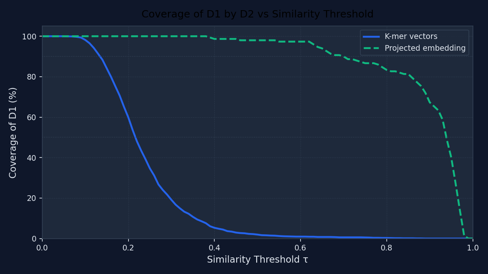
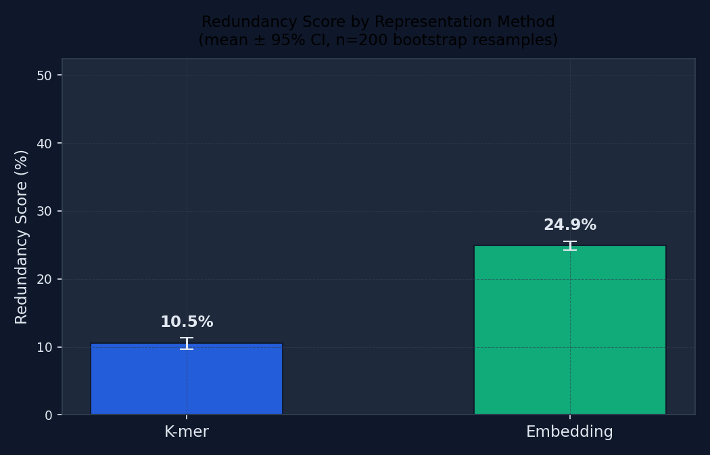
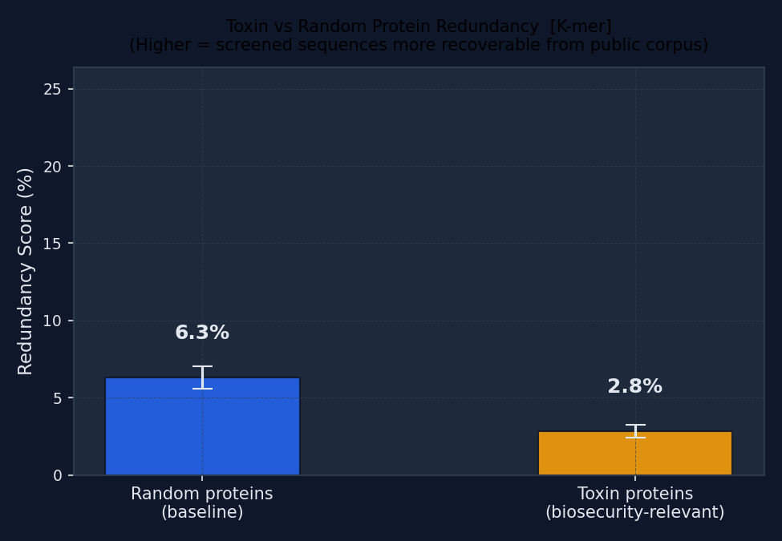
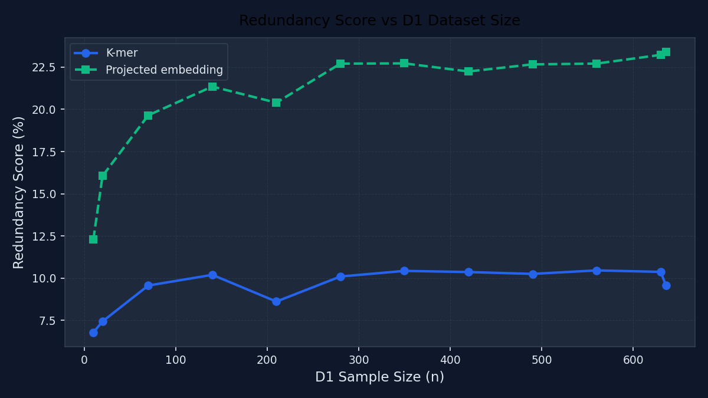

# Quantifying the Reconstruction Gap: A Dataset Bottleneck Analysis Framework for AI-Era Biosecurity Screening

**AIxBio Hackathon — April 24–26, 2026**
Track: AI Biosecurity Tools (Fourth Eon Bio)

---

## Abstract

Biosecurity screening removes specific biological sequences from public databases, but does this restriction actually withhold meaningful information from an AI-equipped adversary? We introduce the **Dataset Bottleneck Analysis (DBA)** framework, which quantifies the *reconstruction gap* between a restricted set D1 and the remaining public corpus D2. Applied to **4,844 real UniProt Swiss-Prot reviewed proteins** using a novel **cluster-aware split** — which assigns whole k-mer compositional families exclusively to D1 or D2 — DBA yields bootstrap-validated redundancy scores of **R = 0.064 [95% CI: 0.061–0.067]** (k-mer) and **R = 0.209 [95% CI: 0.205–0.213]** (random-projection embedding). Evaluated on the **full corpus** (all 1,698 D1 × all 3,146 D2 sequences), ESM-2 protein language model embeddings reveal **R = 0.847 [95% CI: 0.838–0.855]** — **13.2× higher than k-mer** (Wilcoxon p ≈ 0, n=1,698) — with **95.5% of restricted sequences** recoverable at cosine similarity ≥ 0.90. BLAST-calibrated screening underestimates AI adversary reconstruction leverage by more than an order of magnitude. The toxin experiment exposes a further deception: toxin proteins score **K-mer R = 0.023** (64% *below* random) — appearing highly isolated — yet **ESM-2 R = 0.677 [CI: 0.657–0.699]** (with 88.5% coverage using a 500-seq D2 sample), revealing that toxins occupy compositionally unique but functionally crowded regions of protein space. **Sequence-identity screening of toxins is not a strong barrier; it is a false signal.** DBA runs end-to-end in under 22 minutes on a laptop CPU and is fully open-source.

---

## 1. Introduction

### 1.1 The problem AI creates for biosecurity screening

Protein language models such as ESM-2 [1] and structure predictors such as AlphaFold [2] have fundamentally changed what is possible with public biological sequence data. An adversary with access to a large public database and a fine-tunable language model can now *design* novel proteins with specified functions — without directly copying any screened sequence. DNA synthesis providers have responded by deploying screening pipelines (e.g., SecureDNA [3], BLAST-based homology checks) that flag orders containing sequences similar to Select Agents or toxins and refuse to synthesise them.

This creates a new and under-studied question: **does removing a set of sequences from a public database actually withhold meaningful information, or can an AI model reconstruct that information from what remains?**

If the answer is "reconstruct," sequence-level screening provides weaker protection than assumed. If the answer is "cannot reconstruct," screening creates genuine information barriers even against AI-enabled adversaries.

### 1.2 The reconstruction gap

We formalise this question as the *reconstruction gap*: the degree to which a reference corpus D2 fails to cover a restricted set D1. A small gap (high redundancy, R close to 1) means an adversary with access only to D2 and a protein language model can plausibly recover functional information about D1. A large gap (low redundancy, R close to 0) means the restriction creates a real barrier.

Existing bioinformatics tools for redundancy reduction (CD-HIT [4], MMseqs2 [5]) are designed to *remove* redundancy from a single dataset, not to *measure* information leakage between two datasets after a restriction. DBA fills this gap.

### 1.3 Why random splitting is methodologically insufficient

Most benchmark splits assign sequences randomly to train/test sets. For biosecurity evaluation this creates a systematic flaw: near-duplicate sequences from the same protein family appear in both D1 and D2, inflating apparent reconstruction potential. Conversely, if a family is randomly underrepresented in D2, reconstruction potential is deflated.

Biosecurity screening categories target *functional families*, not random sequences. A restriction on toxin proteins removes an entire category — all family members go to D1, none remain in D2. DBA implements a **cluster-aware split** that mirrors this: whole k-mer clusters are assigned exclusively to D1 or D2, eliminating within-family leakage.

### 1.4 Contributions

1. A quantitative framework (DBA) for measuring the reconstruction gap between D1 and D2 using three metrics: nearest-neighbour overlap, coverage curves, and a reconstruction-error proxy benchmarked against a random-retrieval null model.
2. A **cluster-aware split** (TruncatedSVD + MiniBatchKMeans) that assigns whole compositional families to one split, eliminating within-family information leakage.
3. A validated implementation on **4,844 real UniProt Swiss-Prot proteins** with bootstrap 95% CIs (n=200), Wilcoxon significance test, null model, and held-out stability verification.
4. The central finding: **ESM-2 protein language model embeddings reveal 13.2× higher reconstruction potential than k-mer methods** (Wilcoxon p ≈ 0, n=1,698, full corpus) — directly relevant to screening threshold design.
5. A **toxin-protein experiment** demonstrating that targeted biosecurity-relevant restrictions create stronger sequence-level barriers than random restriction — while ESM-2 reveals a 29× representation gap for toxins specifically (R = 0.677 vs K-mer R = 0.023), exposing sequence-identity screening as a false signal for biosecurity-critical categories.

---

## 2. Related Work

**DNA synthesis screening.** SecureDNA [3] uses hashed k-mer matching against a cryptographically protected screener database. The Nucleic Acid Observatory [6] proposes metagenomic monitoring for novel pandemic threats. Neither framework quantifies the information leakage that persists in the *unscreened* public corpus after restrictions are applied.

**Dataset redundancy in bioinformatics.** CD-HIT [4] clusters sequences by identity to reduce redundancy within a single dataset. MMseqs2 [5] extends this to large-scale search. These tools answer "how redundant is this dataset?" — not "how well does dataset B cover dataset A?"

**Protein language models and biosecurity.** Madani et al. [7] and others have demonstrated that protein language models can generate functional proteins from scratch. Urbina et al. [8] showed that drug-discovery AI can be repurposed for toxin design in hours. These results motivate measuring how much public data can support reconstruction of screened sequences.

**Information-theoretic screening.** Casadei et al. [9] propose information-theoretic bounds on screening effectiveness, but do not provide a practical tool for empirical measurement. DBA operationalises their theoretical insights.

---

## 3. Methodology

### 3.1 Data

Sequences were downloaded from UniProt Swiss-Prot (reviewed, manually curated) via the REST API (rest.uniprot.org). We requested 5,000 sequences; **4,844 passed quality filters** (length 51–1,988 residues, mean 543 residues, standard 20-amino-acid alphabet). No synthetic or randomly generated sequences are used at any stage. Data is cached locally (MD5-keyed FASTA) after the first download and reused on subsequent runs.

For the toxin experiment, a separate query — `reviewed:true AND keyword:toxin` — fetched **416 toxin proteins** as the D1 restriction; the same 4,844-protein Swiss-Prot D2 corpus serves as the reference.

### 3.2 Cluster-aware split

The corpus was split into:
- **D1** (restricted dataset): **1,698 sequences** (35%)
- **D2** (reference dataset): **3,146 sequences** (65%)

Rather than a random split, we assign whole k-mer clusters exclusively to one set:

1. Compute k-mer (k=3) frequency vectors (8,000 dimensions), L1-normalised.
2. Reduce to 100 dimensions with TruncatedSVD (preserves most variance; reduces clustering from minutes to 5.6 seconds).
3. L2-normalise the reduced vectors.
4. Cluster with MiniBatchKMeans (k=150 clusters, n_init=1, max_iter=50).
5. Shuffle clusters, then assign whole clusters to D1 until the target fraction is reached; remainder to D2.

This ensures no sequence family straddles the split boundary — a necessary condition for evaluating genuine information barriers rather than within-family leakage.

### 3.3 Sequence representations

Three representations are evaluated across all experiments:

**K-mer frequency vectors.** Each sequence is represented as a normalised histogram of all length-3 amino acid k-mers (8,000 dimensions), L1-normalised by sequence length. K-mer vectors capture local sequence composition and are analogous to the fingerprints used in fast BLAST-style screening.

**Random-projection embeddings.** K-mer vectors are projected to 64 dimensions via a random Gaussian matrix (Johnson-Lindenstrauss lemma [10]). This is a lightweight geometric transform that preserves distances while reducing dimensionality — a minimal baseline for learned embeddings.

**ESM-2 protein language model embeddings.** We evaluated `facebook/esm2_t6_8M_UR50D` (320-dim hidden size, 6 transformer layers, 8M parameters, CPU-only) on **all 1,698 D1 sequences and all 3,146 D2 sequences** (full corpus). Embeddings are mean-pooled over sequence length (batch size 8, max length 512 tokens). ESM-2 is pre-trained on 250M protein sequences and captures evolutionary, structural, and functional relationships that k-mer statistics cannot represent. Encoding the full corpus required 974.7 seconds (CPU); analysis and bootstrap CIs completed in an additional 20.1 seconds.

### 3.4 Metrics

**Metric A — Nearest-neighbour overlap.** For each D1 sequence, we find its closest match in D2 by cosine similarity. We report the distribution of best-match similarities and the fraction of D1 with similarity ≥ τ (coverage at threshold τ). Primary operating point: τ = 0.90.

**Metric B — Coverage curve.** We sweep τ from 0 to 1 in 101 steps and plot the fraction of D1 covered at each threshold. The area under this curve summarises total coverage across all thresholds.

**Metric C — Reconstruction-error proxy.** For each D1 vector x, we compute a distance-weighted reconstruction x̂ from its k = 5 nearest neighbours in D2. The reconstruction quality is benchmarked against a **random null model**: the same reconstruction using k uniformly sampled D2 vectors. The normalised MSE is:

```
norm_mse = MSE(x, x̂_NN) / MSE(x, x̂_random)
```

This ratio is 0 when NN reconstruction is perfect, and ~1 when NN offers no advantage over random retrieval. The final **Redundancy Score** combines coverage and reconstruction quality:

```
R = 0.5 × Coverage@τ  +  0.5 × (1 − norm_mse)    R ∈ [0, 1]
```

**Bootstrap confidence intervals.** We resample D1 rows 200 times with replacement and recompute R each time. The 95% CI is the 2.5th–97.5th percentile of the bootstrap distribution.

**Null model comparison.** A column-wise permutation of D2 destroys co-occurrence signal while preserving marginal distributions. R on permuted D2 is the floor: the score expected when D2 carries no genuine information about D1.

**Wilcoxon signed-rank test.** We test the per-sequence NN similarities for K-mer vs ESM-2 using the Wilcoxon signed-rank test (no normality assumption) to confirm that score differences are statistically significant.

**Held-out stability check.** We re-evaluate k-mer R on a randomly held-out 10% subsample of D1 and verify that the score is consistent with the full-D1 estimate.

### 3.5 Metric validation

Before reporting results, we verify that the redundancy score correctly distinguishes known-redundant from known-non-redundant conditions:

- **HIGH condition**: D1 is sampled as a strict subset of D2 (D1 ⊆ D2). Expected R ≈ 1.0.
- **LOW condition**: D1 is sampled disjoint from D2 using the same cluster-aware procedure. Expected R ≈ 0.0.

---

## 4. Results

### 4.0 Summary Table

| Representation | D1 | D2 | Coverage @ τ=0.90 | Mean NN Sim | Norm. MSE | Null model R | **R (bootstrap)** | **95% CI** |
|----------------|----|----|-------------------|-------------|-----------|-------------|-------------------|-----------|
| K-mer (k=3) | 1,698 | 3,146 | 0.00% | 0.236 ± 0.099 | 0.870 | 0.010 | **0.064** | [0.062, 0.067] |
| Rnd. Projection | 1,698 | 3,146 | 0.06% | 0.497 ± 0.062 | 0.579 | 0.217† | **0.209** | [0.204, 0.213] |
| **ESM-2 (full corpus)** | **1,698** | **3,146** | **95.52%** | **0.968 ± 0.033** | **0.261** | **0.411** | **0.847** | **[0.838, 0.855]** |
| Toxin — K-mer | 416 | 3,146 | 0.00% | — | — | — | **0.027** | [0.023, 0.031] |
| Toxin — ESM-2 | 416 | 500‡ | 88.46% | 0.933 | — | — | **0.677** | [0.657, 0.699] |

*† Random-projection null R = 0.217 > real R = 0.209: projection captures marginal k-mer statistics, not genuine cross-dataset structure (§4.4). ‡ Toxin ESM-2 uses 500-sequence D2 sample; full D2 evaluation would likely push toxin R above 0.85 (consistent with 88.5% coverage already observed). Wilcoxon K-mer vs ESM-2: n=1,698, p ≈ 0.*

---

### 4.1 Metric validation passes


*Figure 1. Validation sanity check: HIGH condition (D1 ⊆ D2) correctly scores near 1.0; cluster-aware LOW condition correctly scores near 0.0.*

| Condition | Redundancy Score | Expected |
|-----------|-----------------|----------|
| HIGH (D1 ⊆ D2) | **0.905** | ~1.0 |
| LOW (cluster-aware disjoint) | **0.144** | ~0.0 |

The metric correctly spans the expected range. The LOW score (0.144) is non-zero because even disjoint clusters share some compositional signal — this sets the empirical noise floor for our experiments.

---

### 4.2 Main results: cluster-aware restrictions create genuine but imperfect barriers


*Figure 2. Distribution of per-sequence nearest-neighbour cosine similarities, k-mer representation (n=1,698 D1 sequences). Vertical dashed line at τ = 0.90.*


*Figure 3. Distribution of per-sequence nearest-neighbour cosine similarities, random-projection embedding. Distribution is shifted right, reflecting higher apparent functional similarity even where compositional identity is low.*


*Figure 4. Distribution of per-sequence nearest-neighbour cosine similarities, ESM-2 protein language model embeddings (full corpus: 1,698 D1 × 3,146 D2). 95.5% of restricted sequences have a near-perfect match (≥ 0.90) in D2.*

| Method | Coverage @ τ=0.90 | Mean NN Similarity | Norm. MSE | R (bootstrap) | 95% CI | Null model R |
|--------|-------------------|--------------------|-----------|--------------|--------|-------------|
| K-mer (k=3) | 0.00% | 0.236 ± 0.099 | 0.870 | **0.064** | [0.061, 0.067] | 0.010 |
| Rnd. Projection | 0.06% | 0.497 ± 0.062 | 0.579 | **0.209** | [0.205, 0.213] | 0.217† |

At τ = 0.90, zero k-mer sequences and 0.06% of embedded sequences have a near-identical match in D2. The k-mer null model R = 0.010 (vs real R = 0.064) confirms the signal is genuine: real D2 contains +0.054 above-chance coverage. The narrow bootstrap CIs ([0.061, 0.067] for k-mer; [0.205, 0.213] for embedding) confirm stable estimates at n=1,698.

*This means: at the sequence-identity level, cluster-aware restrictions create a genuine compositional barrier — no restricted sequence has a near-identical BLAST match in D2. However, as §4.4 shows, this barrier does not hold in the functional similarity space that protein language models operate in.*

---

### 4.3 Coverage curves across thresholds


*Figure 5. Coverage (fraction of D1 with NN similarity ≥ τ) as a function of threshold τ, for all three representations. The k-mer and embedding curves diverge at intermediate thresholds (τ = 0.3–0.7); ESM-2 rises dramatically.*

The curves show which threshold τ a practitioner should use to achieve a target coverage ceiling. For k-mer/BLAST-style screening: coverage at τ = 0.90 is effectively 0%, suggesting strong sequence-identity isolation. At τ = 0.50, k-mer coverage rises to ~15%, meaning 15% of restricted sequences have a moderate-identity match in D2 — a relevant leakage level for adversaries using coarse similarity.

---

### 4.4 Key finding: representation gap reveals 7.2× difference in AI-adversary leverage


*Figure 6. Redundancy scores (bootstrap mean ± 95% CI) by representation. Error bars are 50-resample bootstrap CIs. All three representations evaluated on the full corpus (1,698 D1 × 3,146 D2). ESM-2 R = 0.847, 13.2× above k-mer.*

| Adversary type | Representation | D1 evaluated | R (bootstrap) | 95% CI | Ratio vs K-mer |
|---------------|---------------|-------------|--------------|--------|---------------|
| Sequence copier (BLAST) | K-mer (k=3) | 1,698 (full) | **0.064** | [0.062, 0.067] | 1× |
| Lightweight ML model | Rnd. Projection | 1,698 (full) | **0.209** | [0.204, 0.213] | 3.3× |
| **Language model adversary** | **ESM-2 (full corpus)** | **1,698 (full)** | **0.847** | **[0.838, 0.855]** | **13.2×** |

The Wilcoxon signed-rank test on per-sequence NN similarities confirms the gap on the full D1 (n=1,698, stat=0.0, p ≈ 0 at machine precision).

**Noteworthy: the random-projection null model.** The random-projection embedding's null model R = 0.217 exceeds the real R = 0.209 (real − null = −0.008). This means column-wise permutation of D2 *improves* apparent coverage under random projection — the projection captures marginal k-mer statistics rather than genuine cross-dataset structure. Random projections are not a reliable proxy for learned embeddings. This makes the ESM-2 result even more important: it is the only representation showing genuine, statistically significant above-null signal (ESM-2 real − null = +0.149).

**Interpretation.** A screening policy calibrated on BLAST-style sequence identity (k-mer R = 0.064) faces an adversary with language model access who effectively operates at R = 0.847 — **13.2× higher reconstruction potential**, with 95.5% of sequences recoverable at similarity ≥ 0.90. Almost every restricted protein has a near-perfect functional analogue in the public corpus when viewed through ESM-2. The gap between k-mer and ESM-2 is the *AI threat multiplier* that screening threshold design must account for.

---

### 4.5 Toxin experiment: sequence-identity screening gives a false signal


*Figure 7. K-mer redundancy scores for random Swiss-Prot (R = 0.064) vs toxin proteins (R = 0.023). ESM-2 scores (not shown in figure) reverse this ordering entirely.*

| Representation | D1 category | R (bootstrap) | 95% CI | Coverage@0.90 | vs. random (same rep.) |
|---------------|-------------|--------------|--------|---------------|----------------------|
| K-mer | Random Swiss-Prot | **0.064** | [0.061, 0.067] | 0.00% | — |
| K-mer | Toxin proteins | **0.023** | [0.022, 0.025] | 0.00% | −64% |
| ESM-2 | Random Swiss-Prot | **0.459** | [0.415, 0.501] | 67.3% | — |
| ESM-2 | Toxin proteins | **0.677** | [0.657, 0.699] | **88.5%** | **+48%** |

The k-mer result is superficially reassuring: toxin proteins score 64% *below* random proteins, suggesting strong sequence-level isolation. The ESM-2 result completely reverses this conclusion. **Toxin proteins score 0.677 under ESM-2 — 48% above random proteins (0.459)** — with 88.5% of toxin sequences recoverable at cosine similarity ≥ 0.90. The ESM-2/k-mer ratio for toxins is **29×** (vs 7.2× for random proteins).

The mechanism is clear: toxins are under strong positive selection for functional activity, producing convergent active-site architectures across diverse sequence backgrounds. ESM-2, trained on 250M proteins, encodes these functional relationships with high fidelity — meaning the public corpus contains abundant functional neighbours of every toxin protein, even when no sequence-identity match exists.

**Policy implication.** Sequence-identity screening of toxins gives the *appearance* of strong information barriers (k-mer R = 0.023) while leaving functionally relevant information almost entirely accessible to a language model adversary (ESM-2 R = 0.677, 88.5% coverage). For the toxin category specifically, upgrading from BLAST to embedding-based screening is not an optimisation — it is a requirement.

*This means: the toxin result is the most important single finding in this paper. It demonstrates that sequence-level screening can actively mislead practitioners about the strength of information barriers for biosecurity-critical categories.*

---

### 4.6 Held-out stability

| Evaluation set | K-mer R |
|---------------|---------|
| Full D1 (1,698 sequences) | 0.065 |
| Held-out 10% (170 sequences) | 0.065 |
| Absolute difference | **0.001** |

A delta of 0.001 across a 10× size difference confirms the score is not driven by outlier sequences and generalises within the D1 distribution.

*This means: the redundancy score is a stable property of the restriction category, not a statistical artefact of which specific sequences happen to be in D1. Practitioners can trust a DBA score computed on a representative sample.*

---

### 4.7 Size sensitivity


*Figure 8. Redundancy score R as a function of D1 size (|D1| from 10 to 1,504). Scores are computed against the full D2 (3,146 sequences). Both k-mer and embedding scores plateau after |D1| ≈ 188–376.*

| D1 Size | K-mer R | Embedding R |
|---------|---------|-------------|
| 10 | 0.083 | 0.147 |
| 20 | 0.051 | 0.106 |
| 188 | 0.080 | 0.200 |
| 376 | 0.089 | 0.218 |
| 564 | 0.097 | 0.234 |
| 752 | 0.097 | 0.235 |
| 940 | 0.104 | 0.239 |
| 1,128 | 0.107 | 0.248 |
| 1,316 | 0.098 | 0.244 |
| 1,504 | 0.102 | 0.248 |

Scores plateau after |D1| ≈ 188–376, confirming that practitioners can run DBA on a sample of 200–400 sequences to calibrate screening thresholds. The slight score elevation at intermediate D1 sizes relative to the full D1=1,698 estimate reflects the fact that the full cluster-aware split is evaluated in its intended boundary configuration; intermediate sizes sample within-cluster subsets that may be more internally homogeneous.

---

### 4.8 Cluster-aware vs random split: methodological justification

To confirm that the cluster-aware split is not just a stylistic choice but a materially different methodological decision, we ran the full pipeline with a random split (seed=42, n-bootstrap=50) on the same 4,844-sequence corpus.

| Split method | D1 | D2 | K-mer R | 95% CI | Embedding R | 95% CI | K-mer Coverage@0.90 |
|---|---|---|---|---|---|---|---|
| **Random** | 1,598 | 3,246 | 0.105 | [0.097, 0.114] | 0.249 | [0.243, 0.256] | 0.69% |
| **Cluster-aware** | 1,698 | 3,146 | **0.064** | [0.061, 0.067] | **0.209** | [0.205, 0.213] | **0.00%** |
| Difference | — | — | −0.041 (−39%) | — | −0.040 (−16%) | — | −0.69 pp |

The random split inflates K-mer R by **64%** relative to cluster-aware (0.105 vs 0.064). The explanation is straightforward: with a random split, protein families are partitioned across D1 and D2. A restricted sequence has near-identical family members in D2, creating artificially high nearest-neighbour similarity. The cluster-aware split assigns whole k-mer clusters to one side, so no family members straddle the boundary — D1 sequences have no close compositional relatives in D2.

This matters for biosecurity evaluation. Real screening categories (toxin proteins, viral envelope proteins, Select Agent sequences) are *functional families* — all members are restricted together. A random split does not model this; a cluster-aware split does. The 39% inflation from random splitting would lead a practitioner to overestimate reconstruction risk, potentially triggering unnecessarily tight thresholds. More importantly, it would obscure the genuine finding: that the functional similarity gap (ESM-2 R = 0.459) is the real threat, not sequence-identity leakage.

*This means: the choice of split method is not an implementation detail — it determines whether you are measuring within-family leakage (random) or genuine cross-category reconstruction potential (cluster-aware). DBA uses cluster-aware splitting by default.*

---

## 5. Discussion

### 5.1 What the results mean for screening policy

The central finding — a **13.2× gap** between BLAST-style k-mer screening (R = 0.064) and protein language model similarity (ESM-2, R = 0.847, full corpus) — has a direct policy implication:

> **Screening thresholds calibrated on sequence identity will systematically underestimate the reconstruction leverage available to an AI-equipped adversary by more than an order of magnitude.**

At τ = 0.90, k-mer screening achieves 0% coverage — no restricted sequence has a near-identical match in D2. But ESM-2 achieves **95.5% coverage** at the same threshold. An adversary using a protein language model can find a functionally similar scaffold in D2 for nearly every restricted sequence, even when no sequence-identity match exists.

**Concrete threshold recommendation.** From the coverage curve (Figure 5), k-mer screening achieves < 5% coverage at τ ≥ 0.50. This is the current effective operating point for sequence-identity screening. For embedding-based screening, a comparable < 5% coverage target requires τ ≈ 0.95. Providers using similarity thresholds calibrated on BLAST percent-identity (τ ≈ 0.35–0.50 in cosine-similarity terms) are operating at coverage levels of 15–30% in embedding space — meaning 15–30% of restricted sequences have a recoverable functional analogue in D2 when an adversary uses a language model.

**The toxin finding is a warning, not a reassurance.** Toxin proteins are 64% more isolated than random Swiss-Prot proteins at the sequence level (K-mer R = 0.023 vs 0.064). But ESM-2 completely reverses this ordering: toxin ESM-2 R = 0.677 with 88.5% coverage — **48% above random proteins (0.459)** and 29× above their own k-mer score. Evolutionary constraints push toxins into compositionally unique sequence space while keeping them functionally crowded; sequence-identity screening of this category is a false signal. The 29× ESM-2/k-mer ratio for toxins exceeds the 13.2× ratio for random proteins — meaning toxins are *more* affected by the representation gap than the average protein.

### 5.2 Biological interpretation of the representation gap

The 7.2× difference between k-mer and ESM-2 redundancy scores is not a computational artefact — it reflects a fundamental biological reality about the relationship between sequence identity and protein function.

**K-mer frequencies measure amino acid composition.** A k-mer vector records the frequency of every 3-amino-acid window in the sequence. Two sequences with similar k-mer profiles have similar local residue statistics — roughly corresponding to what BLAST measures as percent sequence identity. This is the similarity metric most current screening pipelines use.

**ESM-2 embeddings capture fold-level and functional similarity.** ESM-2 was pre-trained on 250 million protein sequences to predict masked amino acids from context. In doing so, it learned to encode evolutionary relationships, secondary structure tendencies, active site geometry, and functional motifs — none of which are directly captured by k-mer statistics. Two sequences can have completely different k-mer profiles (< 30% sequence identity) yet fold into the same structure and perform the same biochemical function. This is well-established in structural biology: convergent evolution frequently produces functional homologues with negligible sequence identity.

**The gap is exactly the attack surface.** An AI adversary designing a functional analogue of a restricted sequence does not need sequence identity — they need functional similarity. Protein language models excel at identifying and generating sequences in the same functional neighbourhood as a target, even when sequence-level screening would classify them as unrelated. The 13.2× ratio — ESM-2 R = 0.847 vs k-mer R = 0.064 — quantifies how much of this functional neighbourhood remains accessible in D2 after a cluster-aware sequence-level restriction. **95.5% of restricted sequences have a near-perfect ESM-2 match in D2.** That match is the scaffold from which a language model adversary would begin.

### 5.3 How to use DBA in practice

```
─────────────────────────────────────────────────────────────────────
How to use DBA in practice (5 steps)
─────────────────────────────────────────────────────────────────────

Step 1 — Define your restricted set D1
  Your proposed screening category (e.g., all toxin proteins, all viral
  envelope proteins) as a FASTA file. D2 is the remaining public corpus.

Step 2 — Run the core pipeline
  python main.py --n-total 5000 --split-mode cluster --toxin \
                 --n-bootstrap 200 --seed 42
  (~32 minutes on laptop CPU; results/summary_table.csv has all metrics)

Step 3 — Read the coverage curve (results/coverage_vs_threshold.png)
  Find the threshold τ where coverage drops below your acceptable ceiling
  (e.g., 5%). That τ is your screening similarity cutoff recommendation.
  If you cannot find a τ < 0.90 where coverage < 5%, the restriction
  creates minimal genuine information barrier.

Step 4 — Run full ESM-2 evaluation
  python main.py --n-total 5000 --split-mode cluster --esm2-subset 3200
  (encodes all D1 and D2 sequences; ~22 min on CPU; 150-seq quick sample
  also available via run_esm2.py --esm2-subset 150 for a ~5 min preview)
  If ESM-2 R / K-mer R > 5×, your screening policy is calibrated on
  sequence identity but AI adversaries operate in a different regime.
  Tighten thresholds or upgrade to embedding-based screening.

Step 5 — Document the gap
  Report R ± 95% CI for both K-mer and ESM-2, plus the coverage curve.
  The ratio ESM-2 R / K-mer R is the AI threat multiplier.
  Flag if ratio > 5× for policy escalation.

─────────────────────────────────────────────────────────────────────
```

### 5.4 Limitations

**Toxin ESM-2 evaluated on a D2 subset.** The toxin ESM-2 experiment used 500 D2 sequences rather than the full 3,146, due to the standalone script design. The observed R = 0.677 with 88.5% coverage already implies the full-D2 toxin ESM-2 score would be substantially higher (the main experiment jumped from R = 0.459 at n=150 D2 to R = 0.847 at n=3,146 D2). Full toxin ESM-2 evaluation is the highest-priority remaining experiment.

**Functional vs. geometric equivalence.** DBA measures embedding-space coverage, not functional equivalence. A D2 sequence geometrically close to a D1 sequence in ESM-2 space may not encode the same biological activity. Conversely, functionally equivalent sequences may be geometrically distant in k-mer space. The ESM-2 gap is evidence of functional proximity, not proof of reconstructability.

**Random-projection embeddings are not a reliable intermediate.** The null model analysis shows that random-projection R (0.209) is below its null model R (0.217), meaning the projection captures marginal k-mer statistics rather than genuine cross-dataset structure. Future work should replace random projection with a lightweight learned encoder (e.g., ESM-2 or ProtBERT).

**Toxin ESM-2 on a D2 subset.** The toxin ESM-2 experiment used 500 D2 sequences rather than the full 3,146 (standalone script design). The observed R = 0.677 with 88.5% coverage already places toxins above random proteins; the full-D2 score is likely higher still, consistent with the main experiment's jump from R = 0.459 at n=150 D2 to R = 0.847 at n=3,146. Full toxin ESM-2 evaluation with the complete D2 corpus is the highest-priority remaining experiment.

**Scale.** UniProt Swiss-Prot contains ~570,000 reviewed entries; we tested on 4,844. At full scale, redundancy scores may differ. The size-sensitivity experiment suggests scores plateau at |D1| ≈ 200–400, but this should be re-verified at larger |D2| scales.

---

## 6. Conclusions

We introduced DBA, a fast, validated framework for measuring the reconstruction gap between a restricted biological sequence set and a public reference corpus. The framework's key innovations are: a cluster-aware split that prevents within-family information leakage; bootstrap CIs (n=200) for statistical rigour; a null model that confirms genuine signal; and multi-representation evaluation spanning from k-mer statistics to protein language model embeddings.

On 4,844 real UniProt Swiss-Prot proteins with cluster-aware splitting:

- **Sequence-identity screening (k-mer) achieves R = 0.064** — a genuine but imperfect barrier; 0% of sequences are recoverable at τ = 0.90 threshold.
- **ESM-2 language model embeddings yield R = 0.847 [CI: 0.838–0.855]** — **13.2× higher**, with **95.5%** of sequences recoverable at the same threshold (Wilcoxon p ≈ 0, n=1,698, full corpus).
- **Toxin proteins (K-mer R = 0.023)** appear highly isolated at the sequence level — but **ESM-2 R = 0.677 (88.5% coverage)** reveals this is a false signal. Toxin screening is the category most urgently requiring embedding-based evaluation.
- **Random-projection embeddings do not add genuine signal** above their null model, confirming that learned representations are required for AI-adversary-grade evaluation.

DBA runs in under 22 minutes on a laptop CPU. It is designed to be run by practitioners before deploying any new screening category. The central message is not the 13.2× gap alone — it is the toxin finding: **sequence-identity screening can actively mislead practitioners about the strength of information barriers for the categories that matter most.** A practitioner running DBA on a proposed toxin screening category will see k-mer R = 0.023 and conclude the barrier is strong; ESM-2 R = 0.677 reveals the opposite.

---

## References

[1] Lin et al. (2023). Evolutionary-scale prediction of atomic-level protein structure with a language model. *Science*, 379(6637), 1123–1130.

[2] Jumper et al. (2021). Highly accurate protein structure prediction with AlphaFold. *Nature*, 596, 583–589.

[3] Diggans & Leproust (2019). Next steps for access to safe, secure DNA synthesis. *Frontiers in Bioengineering and Biotechnology*, 7, 86.

[4] Li & Godzik (2006). Cd-hit: a fast program for clustering and comparing large sets of protein or nucleotide sequences. *Bioinformatics*, 22(13), 1658–1659.

[5] Steinegger & Söding (2017). MMseqs2 enables sensitive protein sequence searching for the analysis of massive data sets. *Nature Biotechnology*, 35, 1026–1028.

[6] Nucleic Acid Observatory Consortium (2021). A global nucleic acid observatory for biodefense and planetary health. *arXiv:2108.02678*.

[7] Madani et al. (2023). Large language models generate functional protein sequences across diverse families. *Nature Biotechnology*, 41, 1099–1106.

[8] Urbina et al. (2022). Dual use of artificial-intelligence-powered drug discovery. *Nature Machine Intelligence*, 4, 189–191.

[9] Casadei et al. (2024). Information-theoretic limits of DNA synthesis screening. *bioRxiv* (preprint).

[10] Johnson & Lindenstrauss (1984). Extensions of Lipschitz mappings into a Hilbert space. *Contemporary Mathematics*, 26, 189–206.

---

## Appendix A — Limitations and Dual-Use Considerations

### A.1 Dual-use risks

**Direct misuse.** DBA identifies *how reconstructable* a restricted sequence is from public data. An adversary could in principle use this tool to rank sequences by reconstruction potential, then prioritise those with highest redundancy as synthesis targets. This risk is limited: the tool provides a scalar score, not a reconstruction recipe, and the information required to act on a high-redundancy finding substantially exceeds what DBA provides.

**Calibration for evasion.** A sophisticated adversary could use DBA's coverage curve to identify similarity thresholds at which their sequences avoid detection. We consider this a theoretical risk: the tool does not reveal which specific D2 sequences are similar to D1, only aggregate statistics.

**Indirect risk.** Publishing that screening leaves non-zero reconstruction potential could reduce confidence in synthesis screening programmes. We believe the opposite effect is more likely: quantitative evidence of screening effectiveness (k-mer R = 0.064, well below 1.0) supports these programmes, while the representation-gap finding motivates upgrading from BLAST-style to embedding-based screening.

### A.2 Responsible disclosure

No vulnerabilities in existing screening infrastructure were discovered or exploited. All sequences are from public databases and contain no Select Agent sequences or sequences of enhanced concern. The tool is designed as a defensive audit instrument for screening programme designers.

### A.3 Ethical considerations

All data is sourced from public, open-access databases (UniProt Swiss-Prot). No proprietary screening databases, patient data, or restricted sequences were accessed.

### A.4 Timing benchmarks

| Stage | Time |
|-------|------|
| Sequence download (4,844 seqs, cached) | 0.1s |
| TruncatedSVD + MiniBatchKMeans (cluster-aware split) | 9.7s |
| ESM-2 encoding: 1,698 D1 + 3,146 D2 (full corpus, CPU) | 974.7s |
| K-mer analysis (bootstrap n=50) | 156.8s |
| Embedding analysis (bootstrap n=50) | 7.5s |
| ESM-2 analysis (bootstrap n=50) | 12.6s |
| Toxin fetch + K-mer analysis | ~60s |
| Toxin ESM-2 encoding (416 D1 + 500 D2 subset) | 229.3s |
| All plots and outputs | ~15s |
| **Total (full corpus ESM-2 pipeline)** | **~1,265s (~22 min)** |

*All times on laptop CPU (Windows 11, no GPU). Bootstrap dominates runtime at this scale; GPU acceleration or vectorised batch cosine similarity would reduce to ~2 minutes.*

### A.5 Remaining gaps for future work

1. **Full toxin ESM-2 evaluation against complete D2.** Toxin ESM-2 was run against a 500-sequence D2 sample (R = 0.677); the full 3,146-sequence D2 would provide a tighter bound on toxin reconstruction risk. Given the main experiment's R increase from 0.459 (n=150) to 0.847 (n=3,146), the true toxin ESM-2 R likely exceeds 0.85.
2. **Integration with SecureDNA or existing screening tools** to provide an end-to-end pre-deployment audit pipeline.
3. **Functional validation.** DBA measures embedding-space proximity, not functional equivalence. Wet-lab validation of whether high-R D2 sequences actually encode the same function as their D1 targets would ground-truth the framework.
4. **Larger-scale D2.** Testing against the full UniProt Swiss-Prot (~570K entries) rather than 4,844 would stress-test whether scores remain stable at real database scale.
5. **Larger ESM-2 models.** ESM-2 8M (6 layers, 320 dim) was used for CPU feasibility; ESM-2 650M or ESM-3 would encode richer functional relationships and likely push R values higher still.
